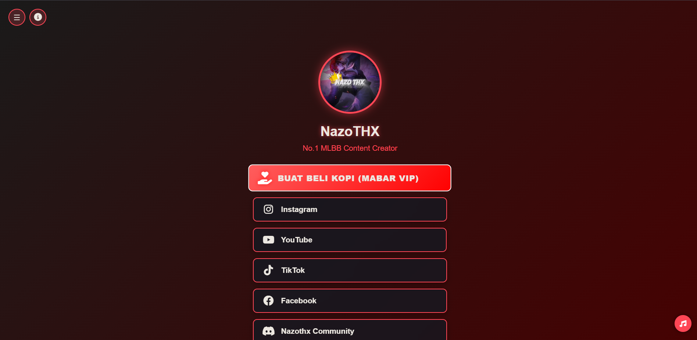

# NazoTHX Linktree Clone

Sebuah halaman tautan personal (Linktree clone) untuk NazoTHX, content creator MLBB, dengan desain inspirasi dari game Valorant.



## Fitur Utama

- **Desain Modern**: Menggunakan tema warna Valorant (merah-hitam) dengan efek gradient
- **Responsif**: Tampilan yang optimal di desktop dan mobile
- **Dark Mode**: Dukungan tema gelap yang bisa disesuaikan
- **Musik Background**: Pemutar musik otomatis dengan kontrol
- **Animasi**: Efek hover dan animasi halus pada tombol
- **Sidebar**: Menu navigasi yang bisa dibuka/tutup

## Teknologi yang Digunakan

- HTML5
- CSS3 (dengan variabel CSS)
- JavaScript (ES6)
- [Font Awesome](https://fontawesome.com/) - Untuk ikon
- [Howler.js](https://howlerjs.com/) - Untuk pemutaran audio

## Cara Menggunakan

1. Clone repository ini atau download sebagai ZIP
2. Buka file `index.html` di browser
3. Fitur yang tersedia:
   - Klik tombol ☰ di kiri atas untuk membuka menu sidebar
   - Klik tombol 🌙 di sidebar untuk mengaktifkan dark mode
   - Klik tombol 🔈 di kanan bawah untuk mengontrol musik
   - Klik tombol tautan untuk membuka media sosial terkait

## Struktur File
nazothx-linktree/
├── index.html # File utama
├── style.css # Stylesheet
├── script.js # JavaScript
├── tt.mp3 # Musik background
├── nazothx.jpg # Foto profil
└── README.md # File ini


## Customisasi

Untuk menyesuaikan dengan kebutuhan Anda:

1. **Profil**:
   - Ganti `nazothx.jpg` dengan foto profil Anda
   - Ubah nama dan deskripsi di `index.html`

2. **Tautan**:
   - Edit atau tambahkan tombol tautan di bagian `<div class="links">`
   - Contoh:
     ```html
     <a href="URL_ANDA" class="link-button">
       <i class="fab fa-twitter"></i>
       <span>Twitter Saya</span>
     </a>
     ```

3. **Musik**:
   - Ganti `tt.mp3` dengan file audio Anda
   - Atur volume di `script.js` (nilai 0-1)

4. **Warna**:
   - Ubah variabel CSS di `:root` untuk tema light
   - Ubah di `.dark-mode` untuk tema gelap

## Catatan

- Beberapa browser mungkin memblokir autoplay musik sampai pengguna berinteraksi dengan halaman
- Pastikan semua tautan eksternal menggunakan `target="_blank"` untuk membuka di tab baru
- Untuk hasil terbaik, gunakan gambar profil dengan rasio 1:1

## Lisensi

Projek ini terbuka untuk umum. Anda bebas memodifikasi dan menggunakan untuk kebutuhan pribadi.

---

© 2025 NazoTHX | Dibuat dengan ❤️ untuk fans MLBB
